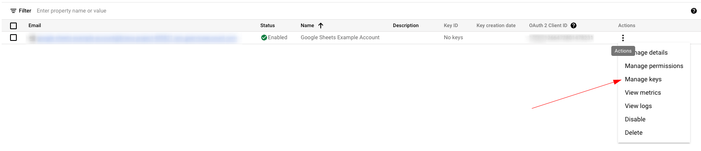
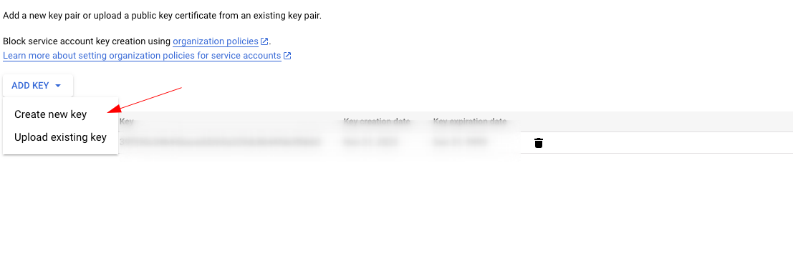
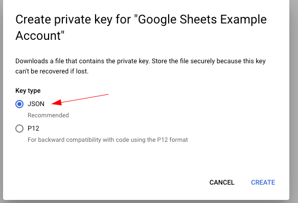

Setting up:

- Create a [service account](https://console.cloud.google.com/iam-admin/serviceaccounts)
  - No permissions are needed
  - Create and download a json key
    
    
    
- Enable the [google sheets api](https://console.cloud.google.com/marketplace/product/google/sheets.googleapis.com?) in your project